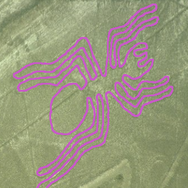

<h1 align="center">colocar</h1>
<p align="center">


</p>

## Introduction
Welcome to **colocar**! This repository houses a number of React.js- and p5.js-based tools for sparse annotations of three-dimensional (primarily spatial) datasets and complementary tools for validation of those sparse annotations.

These are primarily used through deployment to Amazon Web Services (AWS), but they can also be run locally with ease. In either case, they require access to a spatial database that houses the data to be annotated and a document-oriented database to receive the annotations. In particular, the current production workflow pulls imagery from [the Boss](https://github.com/jhuapl-boss/boss) and pushes annotations to [colocard](https://github.com/aplbrain/colocard).

## Setup
### Preamble: colocorazon
First, one must build the shared libraries, found in colocorazon. This can be done by cd-ing into colocorazon and running `yarn && yarn build`. This will transpile the shared libraries into browser-friendly, old-timey JavaScript.

### Amble: installing dependencies
Next, the apps require pulling modules into their node_modules. At present, this can be done by cd-ing into the app directory and running `yarn`.

### Postamble: with your powers combined!
Finally, with all dependencies built and installed, we are ready to run and deploy our apps.

## Running Locally
Each of the apps has a configuration file in the src directory called _config.json. Point this configuration file at the colocard host URL before launching.

At this stage, the apps can be run locally by cd-ing into their directories and running `yarn start`. When the browser launches a window, it will prompt you to enter credentials to the Boss. After successful entry, you will have access to the image data and the web app.

## Deploying to AWS
Each of the colocar apps can be easily built and deployed to AWS using the handy script,  **colocart**. This tool requires a python3 installation with the libraries boto3, click, and colored.

Be sure that the apps have already been set up on AWS via the [quickstart-website](https://console.aws.amazon.com/quickstart-website/home) portal (TODO: this tool was deprecated and is unavailable). This connects a CloudFront service to a particular S3 bucket. The name of that S3 bucket must be entered into the build.cfg file such that the contents are as follows.

```
[UPLOAD]
BucketName = <S3-BUCKET-NAME-OF-APP>
```

Once the apps have had their dependencies installed, the python3 environment is ready, and the configuration file is updated, one can use `./colocart build <APP-NAME> && ./colocart deploy <APP-NAME>` to deploy a fresh version of the current working directory to AWS.

## Directories


<table>
<tr>
    <td>
        
    </td>
    <td>
        <h3 align=center><a href="pointfog/">pointfog</a></h3>
    </td>
    <td>
        <p>Pointcloud generation from images</p>
    </td>
</tr>
<tr>
    <td>
        
    </td>
    <td>
        <h3 align=center><a href="breadcrumbs/">breadcrumbs</a></h3>
    </td>
    <td>
        <p>Skeleton 'graph' tracing from images</p>
    </td>
</tr>
<tr>
    <td>
        
    </td>
    <td>
        <h3 align=center><a href="matchmaker/">matchmaker</a></h3>
    </td>
    <td>
        <p>Skeleton 'graph' pairwise visualization</p>
    </td>
</tr>
<tr>
    <td>
        
    </td>
    <td>
        <h3 align=center><a href="macchiato/">macchiato</a></h3>
    </td>
    <td>
        <p>forced choice point proofreading</p>
    </td>
</tr>
<tr>
    <td>
        
    </td>
    <td>
        <h3 align=center><a href="nazca/">nazca</a></h3>
    </td>
    <td>
        <p>forced choice graph proofreading</p>
    </td>
</tr>
</table>

---

<p align="center"><small>Made with ♥ at <a href="http://www.jhuapl.edu/"></a></small></p>
