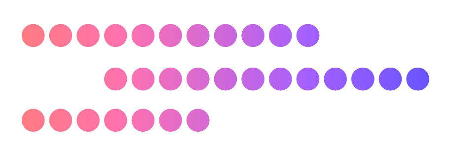

<h1 align="center">colocar</h1>

## Directories

<table>
<tr>
    <td>
        
    </td>
    <td>
        <h3 align=center><a href="breadcrumbs/">breadcrumbs</a></h3>
    </td>
    <td>
        
Skeleton 'graph' tracing from images

    </td>
</tr>
<tr>
    <td>
        
    </td>
    <td>
        <h3 align=center><a href="matchmaker/">matchmaker</a></h3>
    </td>
    <td>
        
Skeleton 'graph' pairwise visualization

    </td>
</tr>
<tr>
    <td>
        
    </td>
    <td>
        <h3 align=center><a href="pointfog/">pointfog</a></h3>
    </td>
    <td>
        
Pointcloud generation from data

    </td>
</tr>
</table>

---

<small>Made with ♥ at </small>

