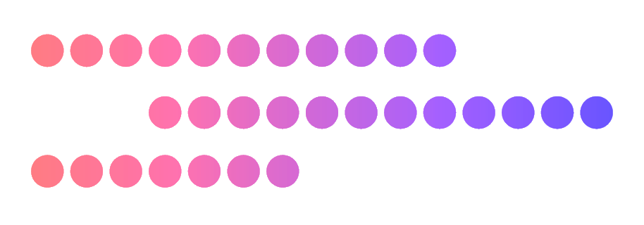

<p align=center></p>
<h3 align=center>p o i n t f o g</h3>
<h6 align=center>simple and scalable graph annotation</h6>

<p align=center></p>

## Installation

```shell
$ yarn
```

## Usage

### Mouse

| Command | Description |
|---------|-------------|
| <kbd>LMB</kbd> | Click to place a new node (Trace Mode only) |
| <kbd>RMB</kbd> | Drag to pan around the scene. Click to select a node |
| <kbd>MMB</kbd> | Scroll to scrub through the z-stack |

### Keyboard

| Command | Description |
|---------|-------------|
| <kbd>tab</kbd> | Toggle between Trace and Pan modes |
| <kbd>q</kbd>, <kbd>e</kbd> | Pan up and down in the z-stack |
| <kbd>+</kbd>, <kbd>-</kbd> | Zoom in and out |
| <kbd>a</kbd> | Mark the current node as an Axon |
| <kbd>d</kbd> | Mark the current node as a Dendrite |
| <kbd>!</kbd> | Mark the current node as a bookmark, to return to later. (Press again to toggle) |
| <kbd>@</kbd> | Return to the previous bookmark |
| <kbd>delete</kbd> | Delete the currently active node |
| <kbd>esc</kbd> | Reset the zoom and pan of the scene |

## Contributors

<!-- ALL-CONTRIBUTORS-LIST:START - Do not remove or modify this section -->
<!-- prettier-ignore -->
| [<br /><sub><b>Jordan Matelsky</b></sub>](http://jordan.matelsky.com)<br />[💻](https://github.com/aplbrain/colocar/commits?author=j6k4m8 "Code") [💬](#question-j6k4m8 "Answering Questions") |
| :---: |
<!-- ALL-CONTRIBUTORS-LIST:END -->

<p align=center>[<a href="https://github.com/kentcdodds/all-contributors#emoji-key">emoji key</a>]</p>
